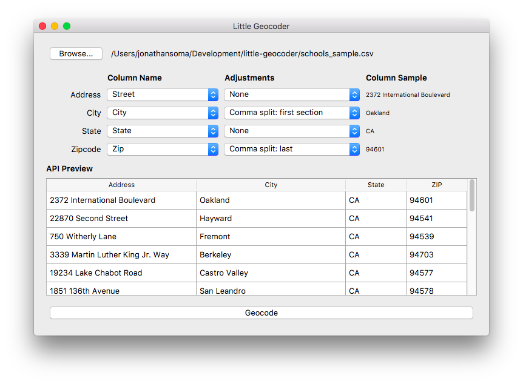

# Simple Visual Geocoder

[Download the latest release](https://github.com/jsoma/simple-visual-geocoder/releases/latest)

## Batch geocode CSV files _on your own machine_ using the Census API

Geocoding is a pain in the neck. If you're just looking at US addresses, though, Simple Visual Geocoder is here to help! **Latitude and longitude are on the way.**



Simple Visual Geocoder takes in CSV files and geocodes them with the [Census Bureau's Batch Geocoding service](https://www.documentcloud.org/documents/3894452-Census-Geocoding-Services-API.html) - **all without knowing Python or using the command line!**

It's more or less a very thin later on top of the LA Times' [Census Batch Geocoder](https://github.com/datadesk/python-censusbatchgeocoder), with the addition of a few simple tools to help you break out street addresses and city names.

As a fun bonus, you don't need to upload your data into 🌪 THE CLOUD 🌪.

## Using Simple Visual Geocoder

### Downloading

You can download the latest release [from GitHub](https://github.com/jsoma/simple-visual-geocoder/releases/latest) - just pick the one that's appropriate for your system.

### Simple How-To

1. Click `Browse...` to select your file
2. Pick your columns that contain address, city, state and zipcode (state and zipcode are optional)
3. Click `Geocode` button, pick a destination for your new geocoded data
4. Wait and wait and wait (don't worry, it isn't frozen!)
5. A brand-new CSV file shows up, full of latitudes and longitudes!
6. 🎉🎉🎉

### Cleaning your data with "Adjustments"

The Census Bureau requires you do split `address`, `city`, `state`, and `zipcode` into separate fields. But what if your addresses aren all in one column and  look like this?

```
540 Streetsway Avenue, Townsville, NC
101 Rock and Roll St, Apt 3, Guitar City, NV
```

Oh no! Do we need to split it apart? Do we need to get rid of that apartment? No! No! **Don't worry, Simple Visual Geocoder is here!** It has built-in data cleaning tools called Adjustments to make splitting long addresses up easy.

When you pick your column for `address` you can add an Adjustment: "Split up the _big long full address_ according to the commas, and only give me the _first section_." That would give us `540 Streetsway Avenue ` and `101 Rock and Roll St`.

You can also pluck out the states from the end by saying "Split it up by commas and give me the _last_ piece." `NC` and `NV`, delivered to your doorstep.

There are options to use this on both commas as well as newlines/linebreaks.

## Troubleshooting

### I think maybe it only works on OS X?

But it shouldn't be tough to make it work on PCs, too.

### Help! I told it to geocode and it froze up!

It didn't freeze, it's just busy geocoding for you! It should finish eventually. Just be patient. Very, very patient.

_At some point it would be nice to implement threads so that this doesn't happen._

### Help! I'm building this myself and it's HUGE!

Anaconda on Windows installs versions of numpy & friends that include something called MKL. MKL is big. Anaconda doesn't play nice with `venv` so the only way I could figure out to get around it was to just uninstall Anaconda and install the normal Python.org version instead.	

## Attribution

Icon made by [Smashicons](https://www.flaticon.com/authors/smashicons) from [www.flaticon.com](https://www.flaticon.com/) and is licensed by [CC 3.0 BY](http://creativecommons.org/licenses/by/3.0/)
